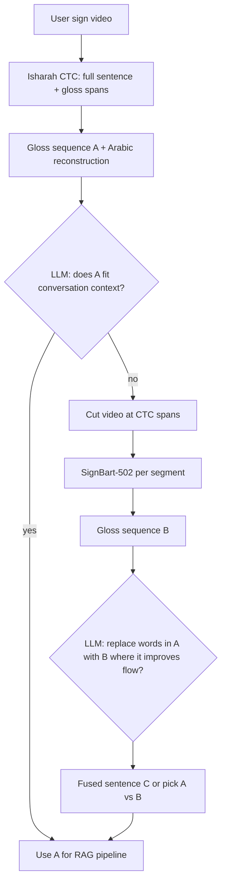

# Continuous sign input: Isharah CTC + LLM arbitration + SignBart fallback

Design notes for understanding **full-sentence** Saudi sign video without relying on pauses between signs. This complements deterministic splitters in `app/segmenter.py` and `app/continuous_sign.py` (black pause, hand pause, motion valleys).

## Goal

Turn one continuous user sign video into a **gloss list** (and then Arabic question text) for the existing Wusal pipeline:

**glosses → reconstruct question → RAG → grounded answer → answer sign video**

The hardest step is **input**: natural signing has no reliable physical “word stop” for every gloss.

## High-level idea

Use a **sentence-level** model trained on Isharah (CTC continuous SLR) as the **first attempt**. Use the **LLM** not only for RAG answers but also to **judge whether the recognized sentence fits the conversation**. If that fails, **cut the video using CTC time spans** and run **SignBart KArSL-502** on each clip (word-by-word model). Use the **LLM again** to decide whether the per-word result is better, or to **merge** both hypotheses into the most plausible sentence.



## Path 1 — Whole sentence (Isharah CTC)

| Step | What happens |
|------|----------------|
| Input | Full clip (Isharah-style continuous sentence) |
| Model | `CSLRModel` trained on Isharah gloss sequences (`scripts/train_isharah_cslr.py`) |
| Output | Ordered gloss list + optional **start/end times** per gloss (CTC decode, not pause detection) |
| Scripts | `scripts/isharah_predict.py`, checkpoint `artifacts/isharah_cslr/best_SI.pt` |

**Important:** CTC is trained with **sentence-level gloss labels only** (no frame-accurate boundaries in the dataset). Per-gloss times are **alignment by-products**; they improve as dev WER improves.

## Path 2 — LLM coherence check (conversation)

After Path 1, reconstruct Arabic (existing `LLMService.reconstruct`) and ask the LLM a **structured** question, for example:

- Given **dialogue context** (prior turns, scenario: airport / medical / etc.)
- Is gloss sequence **A** (and its Arabic gloss) **plausible** as what the user signed?
- Flags: inconsistent topic, impossible word order, contradictions with prior turn, empty/low-confidence CTC decode

If **yes** → proceed to RAG with A.

If **no** → Path 3 (do not trust full-sentence CTC alone).

*Implementation status:* design only; add a dedicated prompt/method on `LLMService` (e.g. `validate_sign_input_for_context`).

## Path 3 — Separation + word-by-word (SignBart)

When full-sentence translation is rejected:

1. **Segment** using CTC spans (`scripts/isharah_split_video.py`) **or** deterministic fallback if CTC confidence is globally poor (motion/hand/black pause from `split_continuous_signs`).
2. Run **SignBart KArSL-502** on each segment (`karsl502_recognizer.predict_video`).
3. Build gloss sequence **B** (ordered list from segments).

SignBart is strong on **isolated dictionary-like** clips (~97% top-1 on local KArSL-502 dictionary eval); weak on **uncut continuous** coarticulation. Segmentation is meant to give SignBart clips closer to its training regime.

**Vocabulary note:** Isharah gloss inventory (~960) ≠ KArSL-502 labels (502). CTC segments are for **timing**; final words for Wusal/RAG should come from **SignBart + `karsl502_vocabulary()`**, not raw Isharah gloss strings, unless we add an explicit gloss mapping layer.

## Path 4 — LLM arbitration (fuse A and B)

Compare **A** (full CTC sentence) and **B** (SignBart per segment):

| Strategy | Description |
|----------|-------------|
| **Replace** | Start from Arabic/gloss sentence A; swap in SignBart glosses where LLM judges B’s word at that position fits **conversation flow** better. |
| **Pick one** | Choose A or B if the other is clearly inconsistent with context. |
| **Merge** | Provide both gloss lists + confidences to LLM; output **C** = single best plausible gloss sequence for the user’s intent (conservative: prefer high-confidence SignBart tokens over low-confidence CTC tokens). |

Then feed **final gloss list** into existing `answer_glosses` / RAG pipeline.

*Implementation status:* design only; needs prompts, confidence thresholds, and logging of which path was chosen (`recognition_strategy` in API trace).

## When to use which splitter

| Method | Role |
|--------|------|
| Isharah CTC spans | Primary for **natural continuous** video after SI model is trained |
| Black / hand pause / motion | Demos, merged KArSL clips, or when CTC checkpoint missing or dev WER too high |
| Stable SignBart windows | Optional last resort in `split_continuous_signs` (recognition-guided); not preferred for production if CTC is available |

## Training & data (local)

| Asset | Location |
|-------|----------|
| Videos + labels | `data/isharah/selfi/` (GufranSabri/isharah-selfi) |
| Frame features | `data/isharah/features_dinov2s/` (`scripts/isharah_extract_features.py`) |
| Train SI | `scripts/train_isharah_cslr.py --protocol SI --epochs 60` |
| Predict / split | `isharah_predict.py`, `isharah_split_video.py` |

Full SI training requires features for **SI** train/dev signers (not only the small US subset used in early sanity runs).

## Limitations (honest scope)

- CTC quality on **out-of-domain** video (non-Isharah signers, lighting, framing) is unknown until measured.
- Bad full-sentence decode usually implies **unreliable cuts**; fall back to deterministic segmentation or human review.
- LLM arbitration adds latency and must stay **grounded** (do not invent service facts—only choose among recognition hypotheses).
- Output side remains **KArSL-502 dictionary composition**; Isharah does not replace answer-video generation.

## Suggested API trace fields (future)

```json
{
  "recognition_strategy": "ctc_full | ctc_split_signbart | deterministic_split_signbart | llm_merged",
  "hypothesis_a": { "source": "isharah_ctc", "glosses": [], "accepted_by_llm": true },
  "hypothesis_b": { "source": "signbart_segments", "glosses": [], "segments": [] },
  "final_glosses": [],
  "segmentation_method": "ctc_spans | black_pause | ..."
}
```

## Related code

- `app/isharah_cslr.py` — CTC model + `greedy_decode` spans  
- `app/continuous_sign.py` — pause/motion continuous split for SignBart today  
- `app/llm.py` — reconstruct, grounded answer, gloss planning  
- `app/main.py` — `sign_conversation` entry point  
