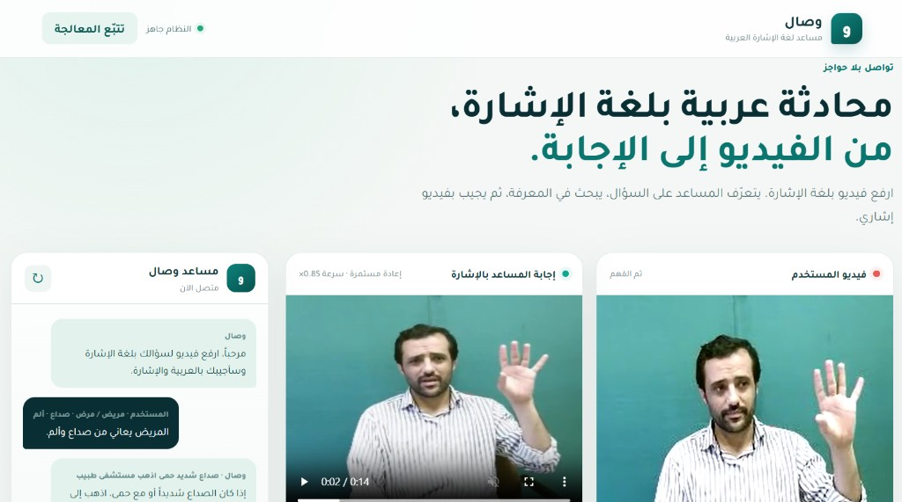
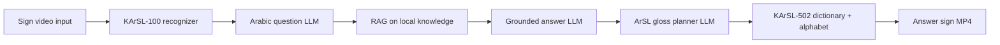

# وصال (Wusal) — Pitch Deck  
### Arabic Sign-Language Conversation · Patent-Pending PoC · Partnership with SDAIA Ecosystem

**Jeham AI** · Confidential — for government / innovation partnership discussion  
Export: copy each slide block into PowerPoint or Google Slides · Screenshots in `docs/assets/`

---

## Slide 1 — Title

**وصال — مساعد محادثة بلغة الإشارة العربية**  
*From sign video → trusted knowledge → sign video answer*

- **Jeham AI**
- Patent-pending system & method
- Working PoC + open engineering repo (private handover on license)
- **Purpose of meeting:** demo architecture · explore **IP license**, **joint R&D**, or **acquisition of PoC + patent**

---

## Slide 2 — Problem (Saudi context)

- Millions rely on **accessible** government and health services; **Deaf and hard-of-hearing** users often face **sign ↔ Arabic text** barriers.
- Generic chatbots **do not** produce **sign-language answers** and **hallucinate** without grounded knowledge.
- **Vision 2030 & digital government:** need **trustworthy Arabic AI** with **explainable stages** and **local knowledge**.

**Our focus:** a **conversation bridge** — not replacing human interpreters, but enabling **24/7 assisted access** and **service triage** patterns.

---

## Slide 3 — Solution in one sentence

**وصال** accepts **Arabic sign video**, understands the question using **recognition + Arabic NLP**, answers using **retrieval-grounded generation (RAG)**, and responds with a **composed sign-language video** from a **controlled dictionary** with **safe fallbacks**.

---

## Slide 4 — What you see in the demo (frontend)

The product UI (**وصال**) is built for **non-technical stakeholders**:

| UI zone | Function |
|---------|----------|
| **فيديو المستخدم** | Upload / drag-drop sign video; optional **continuous sentence** mode (pause segmentation) |
| **مساعد وصال (chat)** | Shows reconstructed **Arabic question** and **grounded Arabic answer** |
| **إجابة المساعد بالإشارة** | Plays composed **H.264 answer video** (dictionary clips + fingerspelling) |
| **تتبّع المعالجة** | Technical trace for due diligence — full AI pipeline visible |

*Screenshot:* `assets/wusal-demo-live.png` (live PoC: recognition + RAG + sign answer video)  
*Optional:* trace panel capture → `assets/wusal-trace-panel.png`

---

## Slide 5 — Patent-pending method (differentiation)

**We protect the orchestrated system**, not one neural net:

1. **Sign video → sign tokens** (temporal recognizer, confidence gating)  
2. **Tokens → Arabic question** (reconstruction without adding facts)  
3. **Local RAG** over approved knowledge (no answer without retrieval context)  
4. **Grounded Arabic answer** (concise, actionable; recommended lines in knowledge base)  
5. **Arabic answer → Saudi ArSL gloss plan** (sign-language ordering, not word-for-word MSA)  
6. **Gloss → media** via dictionary match + **lexical safety** on semantic neighbors  
7. **Fallback:** alphabet fingerspelling + **review_required** flags  

**PoC proves reduction to practice** of the above — suitable for **IP diligence**.

---

## Slide 6 — Pipeline (engineering slide)

**Trace panel labels (from live UI):**

1. التعرّف على الإشارات  
2. السؤال العربي  
3. سياق RAG  
4. إجابة RAG  
5. جملة الإشارة السعودية من LLM  
6. القاموس والتهجئة  
7. بناء فيديو الإجابة  

---

## Slide 7 — PoC status (honest metrics)

| Component | Status |
|-----------|--------|
| End-to-end pipeline | **Working** — FastAPI + Arabic RTL UI |
| Input vocabulary | **100** KArSL word/phrase classes (demo recognizer) |
| Output vocabulary | **502** KArSL clips (463 semantic + 39 alphabet isolated) |
| Knowledge | Curated **Arabic service RAG** (health / safety patterns) |
| Tests | Automated core tests (normalization, dictionary safety, spelling) |
| Production claims | **Not claimed** — signer-independent benchmarks = Phase 2 |

**Message:** Ready for **innovation demo & IP discussion**, not national rollout announcement.

---

## Slide 8 — Why not “just a chatbot”?

| Generic LLM + avatar | **وصال** |
|----------------------|----------|
| Text in / text out | **Sign in / sign out** |
| Open-domain answers | **RAG-grounded** answers |
| Random video lookup | **Thresholded dictionary** + spelling |
| Black box | **7-stage trace** for audit |

Aligns with **SDAIA trustworthy AI** narrative: retrieval, traceability, human review hooks.

---

## Slide 9 — Scale with SDAIA data & infrastructure

**Phase 2 — national-scale architecture (proposed joint work)**

### A. Knowledge (RAG)
- Replace demo markdown with **SDAIA-governed corpora**: public service FAQs, accessibility guides, approved health education (under **PDPL** and data-sharing agreements).
- Same pipeline: **retrieve → generate → sign output**.

### B. Sign language corpus (“SDAIA DB” narrative)
- **Expand vocabulary** beyond 100 input / 502 output toward **domain packs** (government services, education, emergencies).
- **Multi-signer capture:** age, gender, region, camera setups — with consent and metadata.
- Store: video, landmarks, gloss labels, signer ID — for **retraining and evaluation**.

### C. Model training — more words & different persons
- **Recognition model:** temporal network (BiLSTM / Transformer) on landmarks or video; train on combined **KArSL + Saudi-collected** data.
- **Generalization:** hold out **entire signers** (not random clips) for validation; report accuracy per signer cohort.
- **Personalization layer (optional):** calibration per user or lightweight adapter — improves recognition when the same person returns without retraining full model.
- **Output side:** grow **licensed sign clip library**; keep alphabet fallback for OOV terms until clips exist.

### D. Sovereign AI
- Swap cloud LLM for **on-prem Arabic foundation model**; RAG and sign stages unchanged.
- Inference within KSA for **data residency**.

*This slide is the **scale story** SDAIA buys — PoC de-risks the architecture; **data + retrain** de-risks coverage.*

---

## Slide 10 — Roadmap (12–18 months)

| Quarter | Milestone |
|---------|-----------|
| **Q0** (now) | PoC demo, IP / license negotiation, MOU |
| **Q1** | Pilot knowledge integration; deaf-community UX review; on-prem LLM path |
| **Q2** | Signer-diverse data collection protocol; expanded recognizer v2 |
| **Q3** | Signer-independent eval report; domain pack (e.g. health + gov services) |
| **Q4** | Pilot with one agency; accessibility certification pathway |

---

## Slide 11 — Demo script (rehearsed)

1. Show **empty UI** → upload video (e.g. headache / patient scenario).  
2. Let **input video** play; pipeline runs automatically.  
3. Point to **chat** (Arabic Q&A).  
4. Play **output sign video**.  
5. Open **تتبّع المعالجة** — scroll stages 1–7 in ~90 seconds.  
6. Close: *“Patent covers this chain; SDAIA partnership scales data, signers, and sovereign LLM.”*

**Backup:** pre-recorded screen capture if live recognition fails.

---

## Slide 12 — IP & commercial models

| Model | Includes |
|-------|----------|
| **License (exclusive KSA gov sector)** | Patent rights field-of-use, codebase, docs, transition |
| **Joint R&D** | Jeham AI retains IP; SDAIA partner funds data + eval; revenue share / license fee |
| **Acquisition** | Assignment of patent + PoC + handover period |

*Financial terms: separate term sheet (SAR) — not in this deck.*

---

## Slide 13 — Team & ask

**Jeham AI** — architecture, PoC, patent prosecution support.

**We ask today:**
1. Confirmation of **innovation / IP procurement path** (license vs joint lab vs grant).  
2. Introduction to **accessibility & Arabic AI** stakeholders.  
3. Agreement on **next step:** NDA + technical deep-dive + pilot scoping.

**Contact:** [your name · email · Jeham AI]

---

## Slide 14 — Disclaimer

- Research **prototype** — not medical, legal, or emergency dispatch advice.  
- Sign language output requires validation with **Deaf users and certified interpreters**.  
- Third-party sign datasets subject to **license confirmation** for production.  
- Cloud LLM in demo only; production assumes **sovereign deployment**.

---

## Appendix — Slide assets checklist

| Asset | Path / action |
|-------|----------------|
| Main UI screenshot | `docs/assets/wusal-main-ui.png` |
| Trace panel screenshot | Capture after demo → `docs/assets/wusal-trace-panel.png` |
| Chat + output video | Capture after demo → `docs/assets/wusal-chat-result.png` |
| Architecture PDF | `Utility_SL.pdf` (patent figures — do not distribute publicly without counsel) |
| Live demo URL | `http://127.0.0.1:8000` (local) or deployed staging for visit |

---

*End of deck · Jeham AI · وصال signlanguage PoC*
